# V1.x — Claude Subprocess Supervisor (Planning Document)

## 1. Problem Statement

The user's spec: *"The bridge currently spawns claude subprocesses transparently — the parent process just streams stdout and lets claude die when it finishes. The user wants a smarter supervisor: track every spawned claude instance, run an active liveness probe, drive a state machine, push state changes to iOS, and self-heal stale runs by spawning a small diagnostic claude that analyses what went wrong (skipping when rate-limited)."*

The current Go bridge (`apps/rafraf-bridge/internal/claude/runner.go`) maintains an `activeRuns map[sessionID]activeRun` that holds only a `cancel func` + monotonic generation. There is no liveness probe, no state machine, no per-instance push to iOS, and no self-heal. The Prometheus surface exposes only `claude_subprocess_active`/`_total` counters. The legacy psutil-based per-process heartbeat lives in `apps/_archive/` (Python v0.1) and was deliberately not carried over to the Go bridge. The gap is a complete supervisor layer.

## 2. Goals & Non-Goals

### Goals (in scope for V1.x)
- Per-instance state machine with 7 states (`starting`, `running`, `idle`, `stale`, `crashed`, `rate_limited`, `completed`).
- Active liveness probe at a configurable interval (default 5s).
- 6 new envelope types pushed bridge → backend → iOS for every state change of interest.
- Self-heal flow: stale → check rate-limit cache → diagnostic spawn (`--max-tokens 500`, depth ≤ 1) → push diagnosis with recommended action.
- Resource limits: max 3 concurrent supervised instances, max 1 diagnostic recursion depth.
- iOS surface: inline chat banner + Settings drawer history + push notifications for terminal-bad states.
- Feature flag (`supervisor.enabled`, default false in V1.x).

### Non-Goals (explicitly out of scope)
- Per-session GPU monitoring (no NVML/Metal surface).
- Distributed multi-bridge coordination (each bridge supervises only its own subprocesses; broadcast across bridges is a V2 concern).
- Replacing the existing reactive heartbeat on the bridge alive event (`event.bridge.alive`) — supervisor is additive, not a replacement.
- Persisting supervisor state across bridge restarts to disk (orphan adoption is best-effort via `pgrep`, no SQLite/BoltDB).
- Resurrecting the legacy psutil agent path in `apps/_archive/`.
- Auto-retry without user consent (the iOS user always taps "Retry" explicitly).
- Tracking subagent (Task tool) instances individually — the supervisor is for top-level `claude -p` subprocesses only; subagent telemetry stays on the existing `event.session.task_*` channels.
- Cost reporting beyond the diagnostic budget cap; the existing `bridge_claude_total_cost_usd_total` counter remains the source of truth.

## 3. State Machine

### Mermaid

```mermaid
stateDiagram-v2
    [*] --> starting: spawn
    starting --> running: first stdout line OR system/init event
    starting --> crashed: cmd.Start error / immediate exit
    running --> idle: no stdout for >= idle_threshold (default 30s) AND process alive
    idle --> running: new stdout
    running --> stale: no stdout for >= stale_threshold (default 90s) AND process alive
    idle --> stale: no stdout for >= stale_threshold AND process alive
    stale --> rate_limited: rate-limit cache hit during stale-trigger evaluation
    stale --> diagnosing: rate-limit cache miss AND self_heal_enabled
    diagnosing --> running: diagnostic recommends "wait" (treat as transient) — original kept alive
    diagnosing --> stale: diagnostic returns; original still hung
    diagnosing --> crashed: diagnostic itself failed AND original exited
    running --> crashed: cmd.Wait returns non-zero exit
    idle --> crashed: cmd.Wait returns non-zero exit
    stale --> crashed: cmd.Wait returns non-zero exit
    running --> completed: cmd.Wait returns 0 + EventSessionResult observed
    idle --> completed: cmd.Wait returns 0 + EventSessionResult observed
    rate_limited --> completed: rate-limit window expires AND new stdout flows
    rate_limited --> crashed: cmd.Wait fires while waiting for window
    completed --> [*]
    crashed --> [*]
    rate_limited --> [*]: terminal if user does not retry
```



### State Table

| State | Entry trigger | Action on entry | Probe behaviour | Exit transitions |
|---|---|---|---|---|
| `starting` | `Supervisor.Register(pid, sessionID)` from runner | Emit `event.claude.process.spawned` | Probe loop attached; no stale/idle eval until `last_stdout_at` set | → `running` (first stdout) / `crashed` (early exit) |
| `running` | First stdout byte observed | Emit `event.claude.process.healthcheck` (status="running") on every probe tick | `kill -0` + stdout-age + RSS sampled | → `idle` / `stale` / `crashed` / `completed` |
| `idle` | `now - last_stdout_at > idle_threshold` AND alive | Emit healthcheck (status="idle") | Same as running | → `running` (new stdout) / `stale` / `crashed` / `completed` |
| `stale` | `now - last_stdout_at > stale_threshold` AND alive | Emit `event.claude.process.stalled` (carries stderr_tail) | Probe paused; one-shot self-heal check fires | → `rate_limited` / `diagnosing` / `crashed` / `completed` (if stdout resumes) |
| `diagnosing` | Internal sub-state — `Supervisor.spawnDiagnostic()` invoked | Spawn child `claude -p --max-tokens 500` with stderr+last_stdout as prompt | Diagnostic instance is NOT itself supervised (depth guard) | → emits `event.claude.process.diagnosed`; lead instance state then re-evaluated |
| `rate_limited` | Rate-limit cache hit OR diagnosis recommends "wait" with rate cause | Emit `event.claude.process.healthcheck` (status="rate_limited") + push notification | Probe paused; resumes when cache TTL expires | → `running` (window expired, stdout resumes) / `crashed` |
| `crashed` | `cmd.Wait()` non-zero exit OR diagnostic confirms dead | Emit `event.claude.process.crashed` (exit_code, stderr_tail, signal) + push notification | Probe stopped, instance unregistered | terminal |
| `completed` | `cmd.Wait()` returns 0 AND `EventSessionResult` observed | Emit `event.claude.process.healthcheck` (status="completed") | Probe stopped, instance unregistered | terminal |

`event.claude.process.recovered` is emitted as a side event when a `diagnosing → running` transition occurs (carries old + new session_id + recovery reason). `recovery_reason` values: `"diagnostic_recommended_wait"`, `"rate_limit_window_expired"`, `"manual_retry"`.

## 4. Wire Protocol — New Envelope Types

All 6 envelopes are bridge-originated, backend-relayed, iOS-consumed. Outer envelope follows the existing `protocol.Envelope` shape (`type`, `id`, `ts`, `correlation_id`, `target`, `payload`). `target` is `session:<sessionID>` so the backend dispatcher can route via the existing `session:` subscriber map. `correlation_id` carries the originating `command.claude.run` rpc id (matches existing per-RPC envelopes).

### 4.1 `event.claude.process.spawned`

**Originator:** Bridge (`Supervisor.Register` called from `Runner.runWithExec` after `cmd.Start()` succeeds).
**Consumers:** Backend forwarder → iOS `ClaudeProcessRepositoryImpl`.

```json
{
  "type": "event.claude.process.spawned",
  "payload": {
    "session_id": "uuid-string",
    "pid": 49271,
    "started_at": "2026-05-03T10:14:22.143Z",
    "model": "claude-sonnet-4-7",
    "args": ["-p", "--output-format", "stream-json", "--verbose", "--include-partial-messages"],
    "permission_mode": "acceptEdits",
    "project_dir": "/Users/atakan/proj"
  }
}
```

Constraints: `pid > 0`, `started_at` ISO-8601 UTC, `args` excludes the prompt itself (PII guard — orchestrator instruction never leaves the bridge in this channel).

### 4.2 `event.claude.process.healthcheck`

**Originator:** Bridge probe loop (every `probe_interval`, default 5s, only emitted on transition OR every Nth tick to avoid flooding — default coalesce to one healthcheck per state per session per 30s).
**Consumers:** Backend forwarder → iOS history view (NOT pushed as a notification).

```json
{
  "type": "event.claude.process.healthcheck",
  "payload": {
    "session_id": "uuid-string",
    "pid": 49271,
    "status": "running",
    "last_stdout_age_ms": 1850,
    "current_tokens": 1240,
    "memory_rss_kb": 184320,
    "cpu_percent_1s": 12.4,
    "observed_at": "2026-05-03T10:14:27.991Z"
  }
}
```

Constraints: `status ∈ {starting, running, idle, stale, rate_limited, completed}`. `current_tokens` is best-effort from the parser's running tally (zero if unknown). `cpu_percent_1s` computed via two `getrusage` samples per probe, falls back to 0 on platform errors.

### 4.3 `event.claude.process.stalled`

**Originator:** Bridge (state machine transition into `stale`).
**Consumers:** Backend forwarder → iOS banner + push notification.

```json
{
  "type": "event.claude.process.stalled",
  "payload": {
    "session_id": "uuid-string",
    "pid": 49271,
    "last_activity_at": "2026-05-03T10:12:55.412Z",
    "stale_for_ms": 91200,
    "stderr_tail": "Error: connection reset by peer\n  at https://api.anthropic.com/...",
    "stderr_tail_truncated": false,
    "self_heal_pending": true
  }
}
```

Constraints: `stderr_tail` capped at 8 KiB (truncated boolean signals overflow). Emitted exactly once per stale episode (re-entry into `stale` after a `running` blip restarts the counter and re-emits).

### 4.4 `event.claude.process.crashed`

**Originator:** Bridge (`cmd.Wait()` returns non-zero OR diagnostic confirms dead process).
**Consumers:** Backend forwarder → iOS push notification + history view.

```json
{
  "type": "event.claude.process.crashed",
  "payload": {
    "session_id": "uuid-string",
    "pid": 49271,
    "exit_code": 137,
    "signal": "SIGKILL",
    "stderr_tail": "...",
    "duration_ms": 184220,
    "crashed_at": "2026-05-03T10:17:26.633Z"
  }
}
```

Constraints: `signal` empty string when exit was clean-but-nonzero (no signal). `exit_code` is the OS-level exit status (-1 if unknown).

### 4.5 `event.claude.process.recovered`

**Originator:** Bridge (`stale → running` or `rate_limited → running` OR after manual retry).
**Consumers:** Backend forwarder → iOS banner update + history view.

```json
{
  "type": "event.claude.process.recovered",
  "payload": {
    "old_session_id": "uuid-string-A",
    "new_session_id": "uuid-string-A",
    "recovery_reason": "diagnostic_recommended_wait",
    "recovered_at": "2026-05-03T10:18:44.101Z"
  }
}
```

Constraints: `recovery_reason ∈ {diagnostic_recommended_wait, rate_limit_window_expired, manual_retry, stdout_resumed}`. `old_session_id == new_session_id` for self-recovery; differs only on manual retry that issues a new `command.claude.run`.

### 4.6 `event.claude.process.diagnosed`

**Originator:** Bridge (diagnostic claude completes).
**Consumers:** Backend forwarder → iOS banner action area (offers Retry button).

```json
{
  "type": "event.claude.process.diagnosed",
  "payload": {
    "session_id": "uuid-string",
    "diagnosis_text": "Subprocess hung waiting on stdin after a malformed tool_result. Likely a transient stream-json parser deadlock.",
    "recommended_action": "retry",
    "diagnostic_tokens_used": 312,
    "diagnostic_duration_ms": 4820,
    "diagnosed_at": "2026-05-03T10:18:30.998Z"
  }
}
```

Constraints: `recommended_action ∈ {retry, wait, manual}`. `diagnosis_text` capped at 4 KiB. `diagnostic_tokens_used` informational, derived from the diagnostic claude's `EventSessionResult`. Bridge enforces `diagnostic_tokens_used ≤ 500` (cost guard).

### 4.7 New inbound: `command.claude.process.retry`

**Originator:** iOS (Retry button tap).
**Consumers:** Backend → bridge runner.

```json
{
  "type": "command.claude.process.retry",
  "payload": {
    "session_id": "uuid-string",
    "user_id": "uuid-string"
  }
}
```

Bridge handler aborts any zombie supervised instance keyed by session_id and re-issues a fresh `Run()` with the same prompt (cached on the supervisor record). Backend just forwards.

### 4.8 Cross-layer schema alignment

| Layer | Type definition file |
|---|---|
| Go bridge | `apps/rafraf-bridge/internal/protocol/messages.go` (struct definitions); `apps/rafraf-bridge/internal/protocol/builder.go` (constructor wrappers) |
| Backend | `apps/backend/app/schemas/messages.py` (Pydantic models matching field-for-field with snake_case JSON keys) |
| iOS | `apps/ios/RafRaf/Features/ClaudeProcess/Data/DTOs/ClaudeProcessEventDTOs.swift` (Codable structs with explicit `CodingKeys` mapping snake_case → camelCase, mirroring the existing Subagent DTO discipline) |

**Drift guard:** `shared/api-contracts/ws/claude-process-messages.json` — JSON Schema covering all 7 messages.

## 5. Bridge Implementation (Go layer dev — file ownership)

### 5.1 New files

**`apps/rafraf-bridge/internal/claude/supervisor.go`** (~420 LOC)
- `type Supervisor struct { cfg *config.SupervisorConfig; logger *slog.Logger; mu sync.Mutex; instances map[string]*instance; sink SupervisorSink; rateLimitCache *rateLimitCache; diagnosticDepth atomic.Int32 }`
- `type instance struct { sessionID, pid, prompt, model string; startedAt, lastStdoutAt time.Time; state State; stderrRing *ring.Buffer; cancel context.CancelFunc; gen uint64 }`
- `type State` enum (mirrors §3 table).
- `type SupervisorSink interface` — six `On*` methods, one per envelope type. Implemented by a new `wsSupervisorSink` adapter in `cmd/bridge/main.go`.
- `Register(ctx, sessionID, pid, prompt, model, cancel) error` — adds instance, fires probe goroutine, emits `spawned`.
- `Touch(sessionID)` — called by parser on each stdout line to bump `lastStdoutAt`.
- `RecordStderr(sessionID, []byte)` — appended into ring buffer (16 KiB cap, last 8 KiB shipped).
- `MarkRateLimit(sessionID, resetsAt int64)` — caches the rate-limit window per session so the stale handler can short-circuit.
- `Unregister(sessionID, gen)` — called on `cmd.Wait()` return.
- `Shutdown(ctx)` — drains all probe goroutines.
- `probeLoop(ctx, instance)` — ticker at `cfg.ProbeInterval`; runs `kill -0`, `getrusage`, evaluates state transitions.

**`apps/rafraf-bridge/internal/claude/diagnostic.go`** (~180 LOC)
- `func (s *Supervisor) spawnDiagnostic(ctx context.Context, inst *instance) (*DiagnosticResult, error)` — depth-guarded, spawns `claude -p --max-tokens 500 --output-format stream-json` with a fixed system prompt template.

**`apps/rafraf-bridge/internal/claude/supervisor_test.go`** (~520 LOC, ≥9 cases)

### 5.2 Edited files

- `apps/rafraf-bridge/internal/claude/runner.go` — wire `Runner` ↔ `Supervisor` (Register on spawn, Touch per stdout, Unregister on wait).
- `apps/rafraf-bridge/internal/protocol/messages.go` — add 7 type constants + payload structs.
- `apps/rafraf-bridge/internal/protocol/builder.go` — 7 builders.
- `apps/rafraf-bridge/internal/config/config.go` — `SupervisorConfig` with 8 fields.
- `apps/rafraf-bridge/cmd/bridge/main.go` — instantiate supervisor + sink adapter + orphan scan + shutdown wiring.
- `apps/rafraf-bridge/internal/telemetry/prometheus.go` — 3 new metrics.

### 5.3 LOC estimate
~1,380 LOC across 9 files (4 new, 5 edited).

## 6. Backend Implementation (Python layer dev — file ownership)

### 6.1 Edited / new files

- `apps/backend/app/api/routes/agent_ws.py` — 6 new branches + 6 handlers.
- `apps/backend/app/schemas/messages.py` — 7 Pydantic models.
- `apps/backend/app/api/routes/websocket.py` — register `claude_process_retry` inbound handler.
- `apps/backend/app/services/claude_process_forwarder.py` (NEW) — fan-out + per-(user, session, status) coalesce + ProactiveNotification persistence.
- `apps/backend/tests/api/routes/test_agent_ws_claude_process.py` (NEW, ≥4 cases).

### 6.2 LOC estimate
~860 LOC across 5 files (1 new service + 1 new test + 3 edited).

## 7. iOS Implementation (Swift layer dev — file ownership)

> **Naming guard:** existing `apps/ios/RafRaf/Features/Agent/Domain/Models/ClaudeProcess.swift` represents the legacy psutil-driven heartbeat shape. The new V1.x supervisor model lives under a NEW feature folder `Features/ClaudeProcess/` with a richer schema; named `SupervisedClaudeProcess` to avoid same-name type collision in the same module.

### 7.1 New files (17)

Domain models, repositories, DTOs, handlers, use cases, banner component, history view, detail sheet, view model, notification factory, 4 test files.

### 7.2 Edited files (5)

`WebSocketMessageType.swift`, `WebSocketMessage.swift`, `ChatView.swift`, `RafRafApp.swift` (handler registration), `SettingsView.swift` (history navigation).

### 7.3 xcodeproj registration

Pre-allocated UUIDs documented (range `A1B0C0D000000000000001A0` … `A1B0C0D000000000000011A1` for files, group children `…0020A0…0020A8`). Sources phase membership: production → RafRaf target, tests → RafRafTests target.

### 7.4 LOC estimate
~2,140 LOC across 17 new + 5 edited files.

## 8. Concurrency & Safety Guarantees

- **Probe goroutine lifecycle:** ctx-derived from supervisor ctx; Shutdown drains via WaitGroup; race-detector test included.
- **Reconnect storm guard:** in-process state only; healthcheck re-emission on next probe tick.
- **Diagnostic recursion depth:** atomic Int32 CAS-claim, hard ceiling 1.
- **Cost guard:** `--max-tokens 500` enforced in argv, 30s diagnostic timeout, ≈$0.005 per diagnostic.
- **Orphan adoption:** `pgrep -f 'claude.*--output-format'` once at startup, synthetic `orphan-{pid}` session_id, diagnostic disabled for orphans.
- **Concurrent-instance cap:** TryReserveSlot returns `ErrSupervisorSaturated` at MaxConcurrent.
- **Permission broker interplay:** diagnostic spawns bypass `--settings` overlay (no PreToolUse hook for diagnostics).

## 9. Test Strategy

- Go unit: 9 cases. Python unit: 5 cases. Swift unit: 5 cases across 4 files. Integration: fake claude binary that hangs/crashes/rate-limits. E2E: Maestro flow with `kill -STOP`.

## 10. Rollout & Risks

### Rollout
- `supervisor.enabled = false` default for V1.x.
- Staged: developer dogfood → opt-in operators → default-on in V1.(x+1).
- Backend forwarder + iOS handlers ship enabled-by-default (no-op when no bridge sends).

### Risks
1. Cost overrun (HIGH at low likelihood) — mitigations: depth=1, max-tokens 500, rate-limit cache, 30s timeout.
2. Push notification spam (MEDIUM) — backend de-dupe per (user, session, status) over 30s; iOS notification de-dupe identifier.
3. iOS background — local notifications only fire foreground/recently-backgrounded; APNS escalation deferred.
4. Multi-device login — broadcast to all user connections; no cross-device dismiss coordination.
5. Backend offline — bridge queues via existing bounded outbox; reconnect re-emits most recent state.
6. Probe goroutine leak — gen-token + Unregister CAS pattern.
7. Diagnostic hang — 30s timeout + dedicated context.
8. PID reuse after orphan — new spawn overwrites orphan record; accepted.
9. Race between `OnInit.SetModel` and first probe — model defaults to "unknown" until SetModel.

## 11. Open Questions (BLOCKING)

1. **iOS LOC budget:** Swift layer alone ≈2,140 LOC vs the user's "~1.2k total across 3 layers" target. Total all 3 layers ≈4,460 LOC (3.7× overrun). Decide: ship full V1.x, or defer History + Detail views to V1.(x+1) keeping only banner + push notifications?
2. **Swift type naming collision:** existing `ClaudeProcess` (legacy psutil model) vs new `SupervisedClaudeProcess`. Acceptable, OR rename legacy first as a separate migration PR?
3. Diagnostic credentials: same Max-subscription auth (default) vs separate service-level API key for billing visibility?
4. Orphan adoption scope: system-wide (default) vs PPID-lineage restricted?
5. Banner persistence: chat-scoped (default) vs app-level overlay?
6. Healthcheck channel: state-transitions + 30s coalesce (default) vs every-tick?
7. Diagnostic prompt template: hard-coded English (default) vs operator-configurable / Turkish-localized?

---

## Critical Files for Implementation

- `/Users/atakan/Documents/GitHub/atknatk/rafraf/apps/rafraf-bridge/internal/claude/runner.go`
- `/Users/atakan/Documents/GitHub/atknatk/rafraf/apps/rafraf-bridge/internal/protocol/messages.go`
- `/Users/atakan/Documents/GitHub/atknatk/rafraf/apps/backend/app/api/routes/agent_ws.py`
- `/Users/atakan/Documents/GitHub/atknatk/rafraf/apps/ios/RafRaf/Core/Networking/WebSocketMessage.swift`
- `/Users/atakan/Documents/GitHub/atknatk/rafraf/apps/ios/RafRaf.xcodeproj/project.pbxproj`
